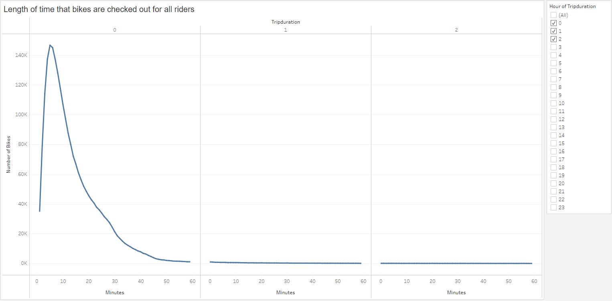
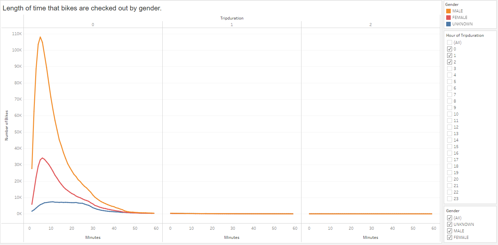
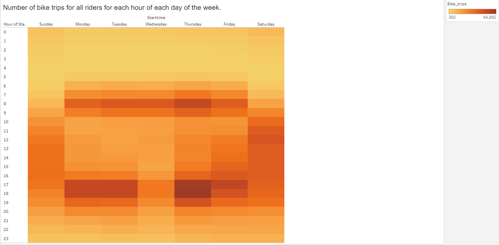
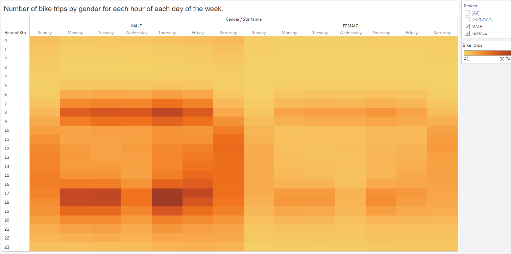
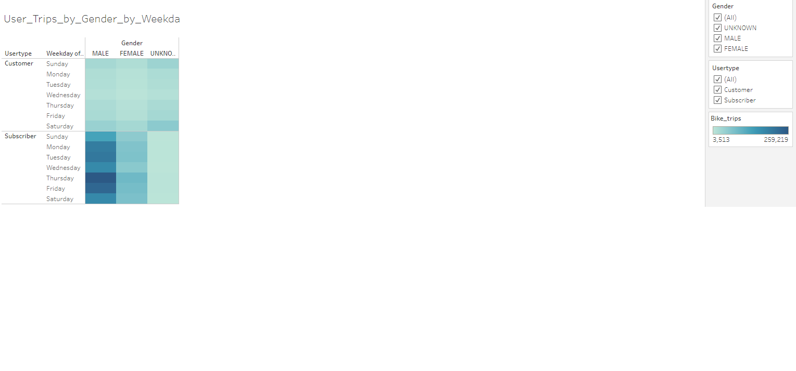
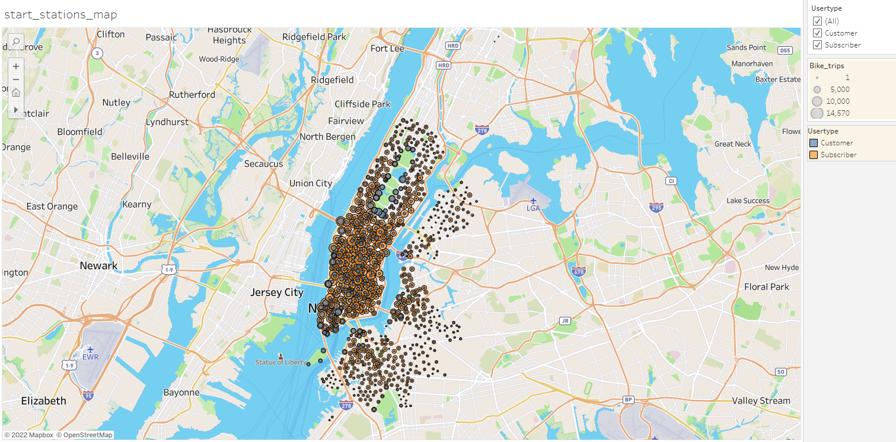
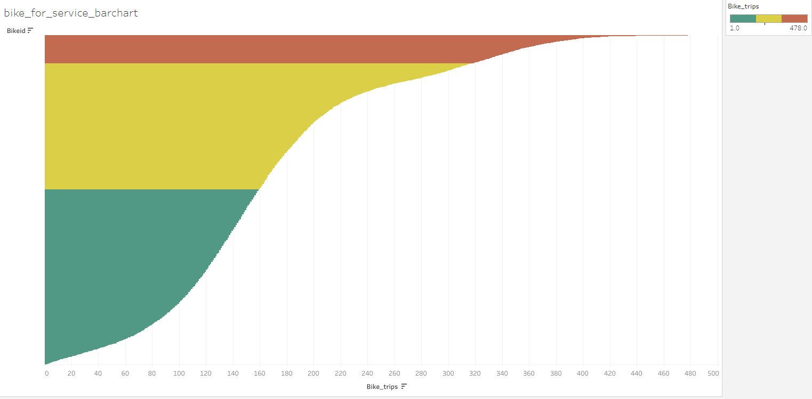
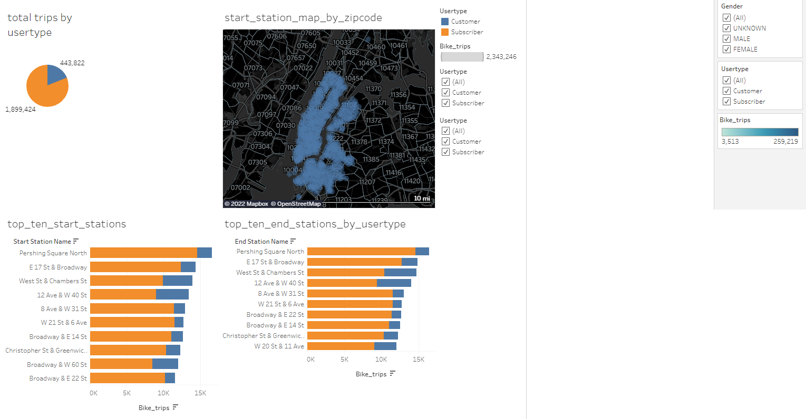

# bikesharing
Using Tableau to create worksheets, dashboards, and stories to visualize data.

## Background
### Overview

This project consists of two technical analysis deliverables and a written report to present our results. 

- Deliverable 1: Change Trip Duration to a Datetime Format

- Deliverable 2: Create Visualizations for the Trip Analysis

- Deliverable 3: Create a Story and Report for the Final Presentation

### Purpose

The purpose of this project is to  to convince investors that a bike-sharing program in Des Moines is a solid business proposal. For that we will use Pandas to change the "tripduration" column from an integer to a datetime datatype. Then, using the converted datatype, we created a set of visualizations to:

- Show the length of time that bikes are checked out for all riders and genders

- Show the number of bike trips for all riders and genders for each hour of each day of the week

- Show the number of bike trips for each type of user and gender for each day of the week.

- Finally, you’ll add these new visualizations to the two you created in this module for your final presentation and analysis to pitch to investors.

## Methodology

- Used Pandas to convert "tripduration" column to a datetime datatype and maked sure had the correct time format.

- Used Tableau, to create visualizations that showed:

  - How long bikes are checked out for all riders and genders.
  
  - How many trips are taken by the hour for each day of the week, for all riders and genders.
  
  - A breakdown of what days of the week a user might be more likely to check out a bike, by type of user and gender.
  
## Resources
 
Data source:
- (1) 201908-citibike-tripdata.csv, (2) NYC_Citibike_Challenge.ipynb
 
Software:
- Visual Studio Code 1.68.1, HTML, Jupyter Lab 1.6.9, Tableau Desktop Public
 
 

### Results

Using Tableau, we created the following visualizations:

 

(a)
 
 Figure (a) Trip Duration All Users

 

(b)
 
 Figure (b) Trip Duration by Gender and Weekday

 

(c)
 
 Figure (c) Heatmap all users

 

(d)
 
 Figure (d) Heatmap by gender and weekday

 

(e)
 
 Figure (e) Trips by user and weekday

 

(f)
 
 Figure (f) Start stations map

 

(g)
 
 Figure (g) Bikes ready for service

 

(g)
 
 Figure (g) Total Trips Dashboard

 

## Summary

- We created our earthquake map with two different maps (Fig a, b) and the earthquake overlay. Then we added the earthquake data in relation to the tectonic plates’ location on the earth, the earthquakes with a magnitude greater than 4.5, and we added the data on a third map (Fig c).

  - [Link to Tableau Dashboard](https://public.tableau.com/app/profile/leonardo.aldarondo/viz/CitiBikeStory_16637907027860/CitibikeStory?publish=yes)

 

## References

[Markdown](https://docs.github.com/en/get-started/writing-on-github/getting-started-with-writing-and-formatting-on-github/basic-writing-and-formatting-syntax)

[Tableau](https://public.tableau.com/app/discover)

[citibike](https://ride.citibikenyc.com/system-data)

[Leaflet](https://leafletjs.com/examples/quick-start/)